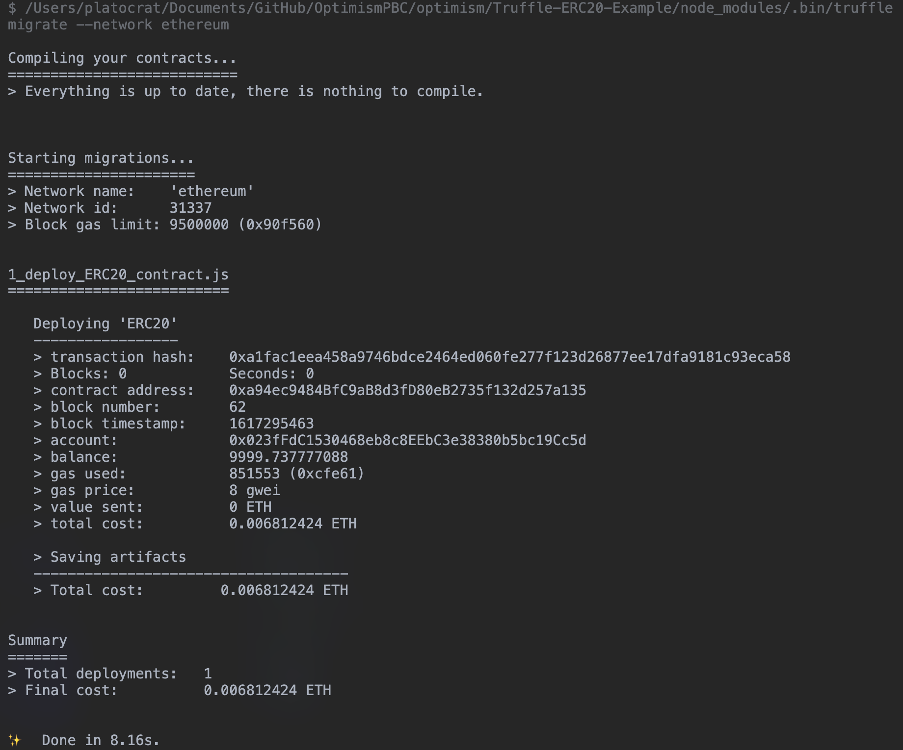
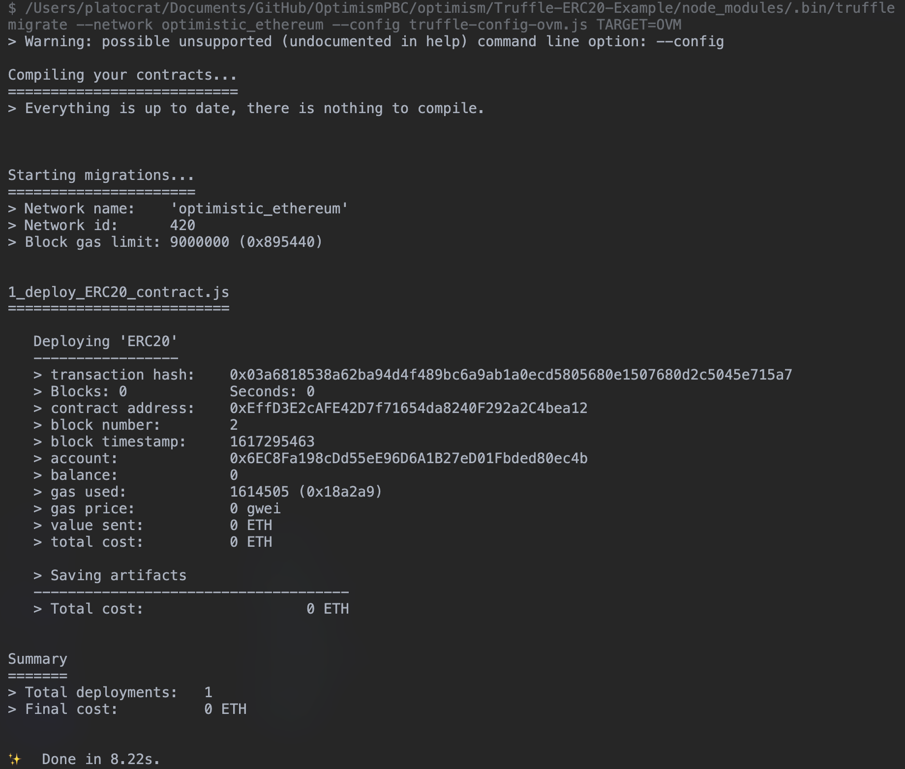

# Getting Started with the OVM: Simple ERC20 Token Truffle Tutorial

Hi there! Welcome to our OVM ERC20 Truffle example!

If your preferred smart contract testing framework is Truffle, see our OVM ERC20 Truffle tutorial here (todo).
If you're interested in writing your first L2-compatible smart contract using Truffle as your smart contract testing framework, then you've come to the right place!
This repo serves as an example for how go through and compile/test/deploy your contracts on both Ethereum and Optimistic Ethereum.

Note that this process is only to give a side-by-side comparison and is _not_ necessary for you to build an application on Optimistic Ethereum. With that out of the way, let's begin!

## Prerequisites

Please make sure you've installed the following before continuing:

- [Git](https://git-scm.com/book/en/v2/Getting-Started-Installing-Git)
- [Node.js](https://nodejs.org/en/download/)
- [Yarn 1](https://classic.yarnpkg.com/en/docs/install#mac-stable)
- [Docker](https://docs.docker.com/engine/install/)

## Set up

To start, clone this `Truffle-ERC20-Example` repo, enter it, and install all of its dependencies:

```sh
git clone https://github.com/ethereum-optimism/Truffle-ERC20-Example.git
cd Waffle-ERC20-Example
yarn install
```

Then, copy the `.env-example` file and rename it `.env`, like so:

```sh
cp .env-example .env
```

This will give us our environment variables that we'll use later on.

## Step 1: Compile your contracts

### Compile an Ethereum contract

Just like with any other project, we'll first need to compile our Solidity into EVM bytecode.
Let's compile our ERC20 contract by running the following command:

```sh
yarn truffle compile
```

You should now see a new `build/contracts` directory which has some JSON files in it.
If you can see this directory, you're ready to move onto the next section!

### Compile an Optimistic Ethereum contract

Compiling a contract for Optimistic Ethereum is pretty easy!
First we'll need to install the [`@eth-optimism/solc`](https://www.npmjs.com/package/@eth-optimism/solc).
Since we currently only support `solc` versions `0.5.16`, `0.6.12`, and `0.7.6` for Optimistic Ethereum contracts, we'll be using version `0.7.6` in this example.
Let's add this package:

```sh
yarn add @eth-optimism/solc@0.7.6-alpha.1
```

Next, we just need to add a new `truffle-config-ovm.js` file to compile our contracts.
Create `truffle-config-ovm.js` and add the following to it:

```js
module.exports = {
  contracts_build_directory: './build/contracts/ovm',
  networks: {
    optimistic_ethereum: {
      network_id: 420,
      host: '127.0.0.1',
      port: 8545,
      gasPrice: 0
    }
  },
  compilers: {
    solc: {
      // Add path to the optimism solc fork
      version: "node_modules/@eth-optimism/solc",
      settings: {          // See the solidity docs for advice about optimization and evmVersion
        optimizer: {
          enabled: true,
          runs: 1
        },
      }
    }
  }
}
```

Here, we specify the new custom Optimistic Ethereum compiler we just installed and the new build path for our optimistically compiled contracts.
We also specify the network parameters of a local Optimistic Ethereum instance.
This local instance will be set up soon, but we'll set this up in our config now so that it's easy for us later when we compile and deploy our Optimistic Ethereum contracts.

And we're ready to compile! All you have to do is specify the `truffle-config-ovm.js` config in your `truffle` command, like so:

```sh
yarn truffle compile --config truffle-config-ovm.js
```

Our `truffle-config-ovm.js` config file tells Truffle that we want to use the Optimistic Ethereum solidity compiler.

Yep, it's that easy. You can verify that everything went well by looking for inside the `build` directory for the new `ovm` path that contains your new JSON files.

Here, `ovm` signifies that the contracts contained in this directory have been compiled for the OVM, the **O**ptimistic **V**irtual **M**achine, as opposed to the Ethereum Virtual Machine. Now let's move on to testing!

## Step 2: Test your contracts

### Test an Ethereum contract

Testing with Truffle is easy. We've included a simple set of ERC20 tests inside `Truffle-ERC20-Example/test/erc20.spec.js`. Let's run these tests with `truffle`:

```sh
yarn truffle test ./test/erc20.spec.js
```

If everything went well, you should see a bunch of green checkmarks.

### Testing an Optimistic Ethereum contract

Woot! It's finally time to test our contract on top of Optimistic Ethereum.
But first we'll need to get a local version of an Optimistic Ethereum node running...

-------

Fortunately, we have a handy dandy repository that makes it easy to spin up a local Optimistic Ethereum node!

Since we're going to be using Docker, make sure that Docker is installed on your machine prior to moving on (info on how to do that here).

Now we just need to install our Optimistic Ethereum node by running:

```sh
git clone git@github.com:ethereum-optimism/optimism-integration.git --recurse-submodules
cd optimism-integration
./pull.sh
```

`./pull.sh` will pull the latest version of all of our docker images and make sure everything else is up to date.

Then we'll run the `./up.sh` command to spin up our node:

```sh
./up.sh
```

Give `./up.sh` a little bit to fully start up (could be up to ~30 seconds).
We'll need to keep this terminal running for the rest of this tutorial (it's your Optimistic Ethereum node). Go ahead and open up a second terminal so that you can run more commands while the other terminal is still running.

You now have your very own locally deployed instance of Optimistic Ethereum! 🙌

-------

With your local instance of Optimistic Ethereum up and running, let's test your contracts! Since the two JSON RPC provider URLs (one for your local instance Ethereum and Optimistic Ethereum) have already been specified in your `.env` file, all we need to do next is run the test command.

To do that, run:

```sh
yarn truffle test ./test/erc20.spec.js --network optimistic_ethereum --config truffle-config-ovm.js TARGET=OVM
```

Notice that we are using the `TARGET=OVM` flag to let `truffle` know that we want to use the `build/contracts/ovm` folder as our path to our JSON files.
(Remember that these JSON files were compiled using the Optimistic Ethereum solidity compiler!)

Additionally, we also specify the network we are testing on.
In this case, we're testing our contract on `optimistic_ethereum`.

You should see another set of passing tests. If so, congrats!
You're ready to deploy an application to Optimistic Ethereum.
It really is that easy.

## Step 3: Deploying your contracts

### Deploying an Ethereum contract

Going through this routine one more time. Now we're going to deploy an Ethereum contract using `truffle`. For Truffle based deployments, we're going to use Truffle's `migrate` command to run a migrations file for us that will deploy the contract we specify.

First, let's create that migrations file.
Create a new directory called `migrations` in the topmost path of your project and create a file within it called `1_deploy_ERC20_contract.js`.

Next, within `1_deploy_ERC20_contract.js`, we're going to add the following logic:

```js
const { getArtifact } = require('../utils/getArtifact')

const useL2 = (process.env.TARGET === 'OVM')

module.exports = function (deployer, accounts) {
  const tokenName = 'My Optimistic Coin'
  const tokenSymbol = 'OPT'
  const tokenDecimals = 1

  // deployment steps
  deployer.deploy(getArtifact(useL2, 'ERC20'), 10000, tokenName, tokenDecimals, tokenSymbol)
}
```

To quickly explain this file, first we import a utility function called `getArtifact` which use is used to retrieve either an Ethereum or Optimistic Ethereum compiled contract's artifact.
This is achieved simply through a flag that we pass in on the command line and is implemented in the migrations file with the constant on line 3:

```js
const useL2 (process.env.TARGET === 'OVM')
```

Now we're ready to run our migrations file!
To run it, run the following command:

```sh
yarn truffle migrate --network ethereum
```

This should deploy against a local (in-memory) Ethereum node that was spin up when we started the integrations repo.
Cool.
You'll see something like this in your terminal:



### Deploying an Optimistic Ethereum contract

Next we'll do the same thing on Optimistic Ethereum.
Let's go ahead and deploy this contract:

```sh
yarn TARGET=OVM truffle migrate --network optimistic_ethereum --config truffle-config-ovm.js
```

And once again we're adding `TARGET=OVM` and using the `--network optimism_ethereum` option.
After a few seconds your contract should be deployed! Now you'll see this in your terminal:



And uh... yeah. That's pretty much it. Contracts deployed! Tutorial complete. Hopefully now you know the basics of working with Optimistic Ethereum.

------

## Further Reading

### OVM vs. EVM Incompatibilities

Our goal is to bring the OVM as close to 100% compatibility with all existing Ethereum projects, but our software is still in an early stage. [This document](https://hackmd.io/elr0znYORiOMSTtfPJVAaA) will maintain the most up to date list of known incompatibilities between the OVM and EVM, along with our plans to fix them.

### Wasn't that easy?

The OVM provides a fresh new take on layer 2 development: it's identical to layer 1 development.
No hoops, no tricks--the Ethereum you know and love, ready to scale up with L2.
For more info on our progress and what's going on behind the scenes, you can follow us on [Twitter](https://twitter.com/optimismPBC).

Want to try deploying contracts to the Optimistic Ethereum testnet next? [Check out the full integration guide](https://community.optimism.io/docs/developers/integration.html) on the Optimism community hub.

------

## Troubleshooting

Example project not working? [Create a Github Issue](https://github.com/ethereum-optimism/ERC20-Example/issues), or hop in our [Discord](https://discordapp.com/invite/jrnFEvq) channel and ask away.
